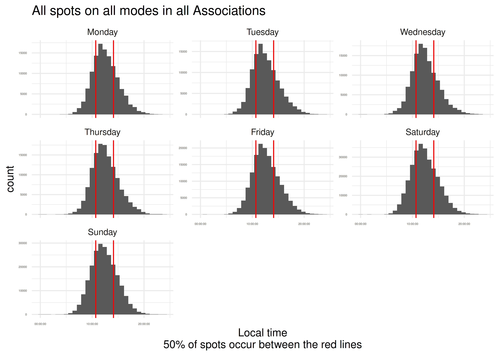
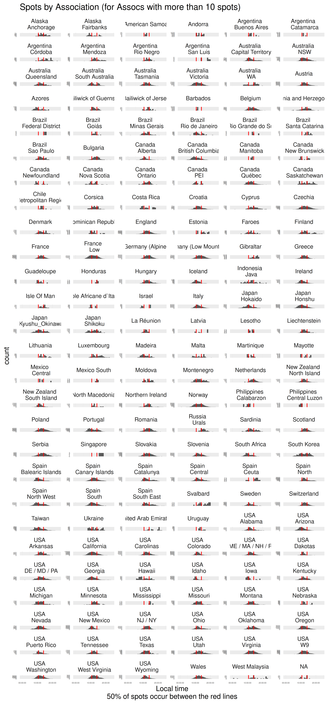
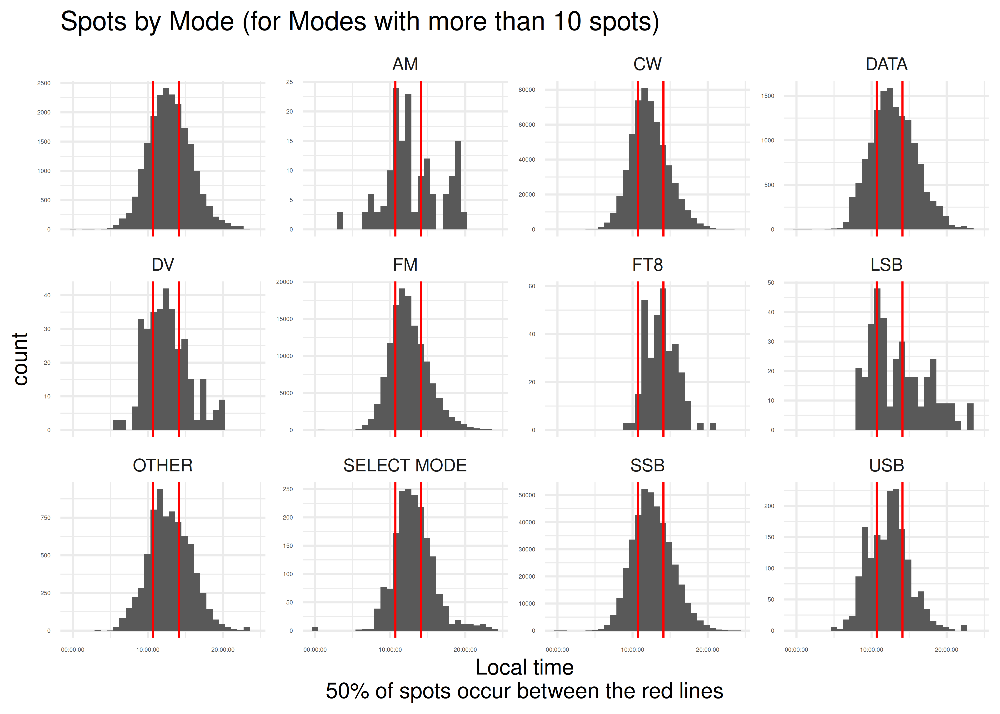

# When do SOTA Activators post their spots?

2025-08-19

The goal of this project is to find the best times to be on a SOTA
summit to have a summit-to-summit contact.

There is a GitHub Actions script that scrapes the SOTA API every 72 h
(the maximum available) and stores the data here.

``` r
library(httr2)
library(tidyverse)
library(sf)
library(lutz)
library(hms)
library(jsonlite)

# get the most recent file
most_recent_file <- 
  list.files("data", full.names = TRUE) %>% 
  magrittr::extract(which.max(file.mtime(.)))

resp_spot <- readRDS(most_recent_file)

# getting spots is documented in the R script file

list_of_rds_files <- 
  list.files("data/", 
              full.names = TRUE)

resp_spot_all <-  
  map(list_of_rds_files, read_rds)

resp_spot <-  
unlist(resp_spot_all, recursive = FALSE)

spot_tbl <- 
resp_spot %>% 
  tibble(resp_spot = resp_spot) %>% 
  unnest_wider(resp_spot) %>% 
  select(-.)

start_time <- 
as_datetime(str_replace_all(min(spot_tbl$timeStamp), 
                            "T", " "),
            format = "%Y-%m-%d %H:%M:%OS", 
            tz = "GMT")
end_time <- 
  as_datetime(str_replace_all(max(spot_tbl$timeStamp), 
                            "T", " "),
            format = "%Y-%m-%d %H:%M:%OS", 
            tz = "GMT")

# formatted combined date, time, and time zone using str_glue() function

start_time <- str_glue("{format(start_time, format = '%A, %B %d %Y, %z  %Z, ')}{format(start_time, format = '%H:%M:%S')}")

end_time <- str_glue("{format(end_time, format = '%A, %B %d %Y, %z  %Z, ')}{format(end_time, format = '%H:%M:%S')}")
```

We have 1,055,687 spots, from Wednesday, November 01 2023, +0000 GMT,
22:43:07 to Tuesday, August 19 2025, +0000 GMT, 01:43:25.

``` r
# get associations so we can get their time zones via lat-long
req <- request("https://api2.sota.org.uk/api/")
resp_assoc <- req %>% 
  req_url_path_append("associations") %>% 
  req_perform() %>% 
  resp_body_json() 
```

First, find the time zone that each SOTA Association is in. We assume
each Association has one time zone (this is probably not true) and we
ignore daylight savings.

``` r
assoc_tbl <- 
resp_assoc %>% 
  tibble(resp = resp_assoc) %>% 
  unnest_wider(resp) 

# find the timezones for each association
assoc_tbl_tz <- 
  assoc_tbl %>% 
  mutate(activeFrom = str_replace_all(activeFrom, "T", " ")) %>% 
  mutate(date = as_datetime(activeFrom, 
                            format = "%Y-%m-%d %H:%M:%S", 
                            tz = "GMT"),
         timezone = tz_lookup_coords(lat = minLat, 
                                     lon = minLong, 
                                     method = "accurate")) 
```

Now we have the time zone for each Association, let’s compute the local
time that each spot was posted, and the day of the week.

``` r
# find the time zone for each spot, via the association that the spot is in
spot_tbl_tz <- 
spot_tbl %>% 
  left_join(assoc_tbl_tz %>% 
              select(associationCode, 
                     associationName,
                     timezone),
            join_by("associationCode")) %>% 
  mutate(timeStamp = str_replace_all(timeStamp, "T", " ")) %>% 
  mutate(timeStamp1 = as_datetime(timeStamp, 
                                format = "%Y-%m-%d %H:%M:%OS", 
                                tz = "GMT")) 

# convert UTC times from the API to local times
# we cannot have multiple time zones in one vector
# so this stays as a list
tzs <- vector("list", length = nrow(spot_tbl_tz))
for(i in 1:nrow(spot_tbl_tz)){
  tzs[[i]] <- with_tz(spot_tbl_tz$timeStamp1[i], 
                      tzone = spot_tbl_tz$timezone[i])
}

# convert time to HMS only, get weekdays
days.of.week <- weekdays(as.Date(4,"1970-01-01",tz="GMT")+0:6)
spot_tbl_tz_local <- 
  spot_tbl_tz %>% 
  mutate(local_time = map_vec(tzs,  ~as_hms(.x))) %>% 
  mutate(day_of_the_week = map_vec(tzs,  ~weekdays(.x)))  %>% 
  mutate(day_of_the_week = factor(day_of_the_week,
                                  levels = days.of.week))

# 50% of spots occur between these local times
fifty_perc <- quantile(spot_tbl_tz_local$local_time, c(0.25,  0.75))

fifty_perc_1 <- format(round_date(as.POSIXct(paste("1900-01-01 ", fifty_perc[1])), unit="1 mins"), "%H:%M")
fifty_perc_2 <- format(round_date(as.POSIXct(paste("1900-01-01 ", fifty_perc[2])), unit="1 mins"), "%H:%M")
```

Most spots are posted on Saturday.

``` r
# plot all in one histogram
spot_tbl_tz_local  %>% 
  ggplot() +
  aes(day_of_the_week) +
  geom_bar() +
  scale_x_discrete(drop = FALSE) +
  theme_minimal() +
  ggtitle("All spots on all modes in all Associations")
```

<div id="fig-by-day">


Figure 1: Frequency of spots by day of the week

</div>

``` r
spot_tbl_tz_local  %>% 
  ggplot() +
  aes(local_time) +
  geom_histogram() +
  geom_vline(xintercept = fifty_perc, colour = "red") +
  theme_minimal() +
  xlab("Local time\n50% of spots occur between the red lines") +
  ggtitle("All spots on all modes in all Associations")
```

<div id="fig-by-hour">


Figure 2: Frequency of spots by time of the day in the activator’s time
zone

</div>

Midday is peak hour for spotting. Fifty percent of spots were posted
between 10:42 and 14:07 in the activator’s local time zone.

``` r
small_x_labels <- 3

# plot all in one histogram
spot_tbl_tz_local  %>% 
ggplot() +
  aes(local_time) +
  geom_histogram() +
  geom_vline(xintercept = fifty_perc, colour = "red") +
  theme_minimal() +
  facet_wrap(~ day_of_the_week, scales = "free_y") +
  xlab("Local time\n50% of spots occur between the red lines") +
  ggtitle("All spots on all modes in all Associations") +
  theme(axis.text=element_text(size = small_x_labels))
```

<div id="fig-by-hour-day">



Figure 3: Frequency of spots by time in the activator’s time zone and
day of the week

</div>

Midday seems to be preferred regardless of the day of the week.

``` r
spot_tbl_tz_local %>% 
  add_count(associationName) %>% 
  filter(n >= 10) %>% 
  mutate(associationName = str_replace(associationName, "-", "\n")) %>% 
  ggplot() +
  aes(local_time) +
  geom_histogram() +
  geom_vline(xintercept = fifty_perc, colour = "red") +
  theme_minimal() +
  xlab("Local time\n50% of spots occur between the red lines") +
  facet_wrap(~ associationName, 
             scales = "free_y",
             ncol = 6) +
  ggtitle("Spots by Association (for Assocs with more than 10 spots)") +
  theme(axis.text=element_text(size = small_x_labels))
```

<div id="fig-by-hour-by-association">



Figure 4: Frequency of spots by time in the activator’s time zone for
each Association

</div>

Activators in Japan are spotting earlier than most others. Activators in
Spain are generally later than average. Within the US, Arizona is where
the early spotting is, and Virginia do the late shift.

``` r
spot_tbl_tz_local  %>% 
  mutate(mode = str_squish(toupper(mode))) %>% 
  add_count(mode) %>% 
  filter(n >= 100) %>% 
  ggplot() +
  aes(local_time) +
  geom_histogram() +
  geom_vline(xintercept = fifty_perc, colour = "red") +
  theme_minimal() +
  xlab("Local time\n50% of spots occur between the red lines") +
  facet_wrap(~ mode, scales = "free_y") +
  ggtitle("Spots by Mode (for Modes with more than 10 spots)") +
  theme(axis.text=element_text(size = small_x_labels))
```

<div id="fig-time-and-mode">



Figure 5: Frequency of spots by time in the activator’s time zone and
mode

</div>

Activators on FM tend to be earlier than those on SSB. Perhaps many of
these are the same people, starting their activation on FM, then
switching to SSB.

``` r
spot_tbl_tz_local %>% 
  add_count(summitCode) %>% 
  filter(n >= 50) %>% 
  ggplot() +
  aes(local_time) +
  geom_histogram() +
  geom_vline(xintercept = fifty_perc, colour = "red") +
  theme_minimal() +
  xlab("Local time\n50% of spots occur between the red lines") +
  facet_wrap(~ summitCode, scales = "free_y") +
  theme(axis.text=element_text(size = small_x_labels))
```

<div id="fig-time-and-summit">


Figure 6: Frequency of spots by time in the activator’s time zone and
summit

</div>

``` r
spot_tbl_tz_local %>% 
  add_count(activatorCallsign) %>% 
  filter(n >= 100) %>% 
  ggplot() +
  aes(local_time) +
  geom_histogram() +
  geom_vline(xintercept = fifty_perc, colour = "red") +
  theme_minimal() +
  xlab("Local time\n50% of spots occur between the red lines") +
  facet_wrap(~ activatorCallsign, 
             scales = "free_y",
             ncol = 4) +
  ggtitle("Spots by Activator (for Activators with more than 100 spots)") +
  theme(axis.text=element_text(size = small_x_labels))
```

<div id="fig-time-and-activator">


Figure 7: Frequency of spots by time in the activator’s time zone for
activators with more than ten spots

</div>
